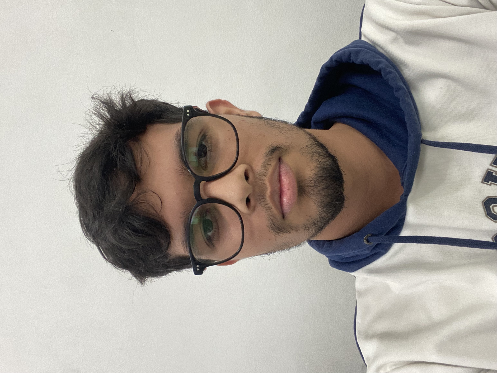
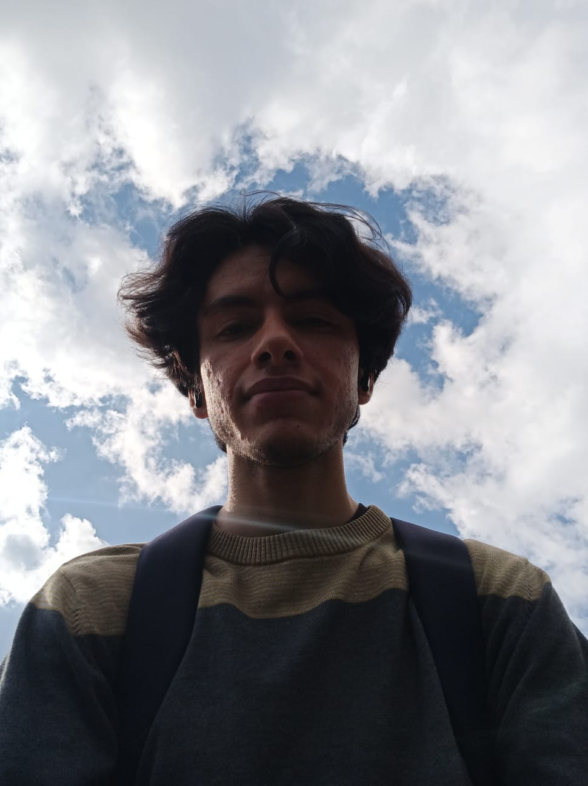
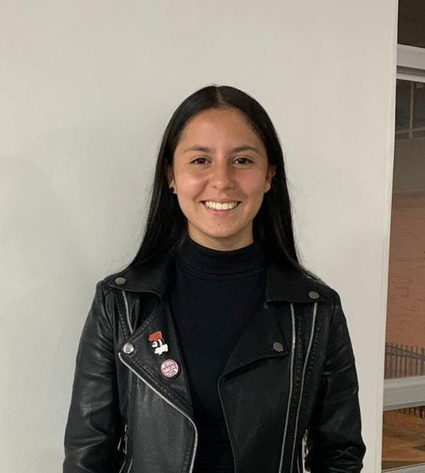
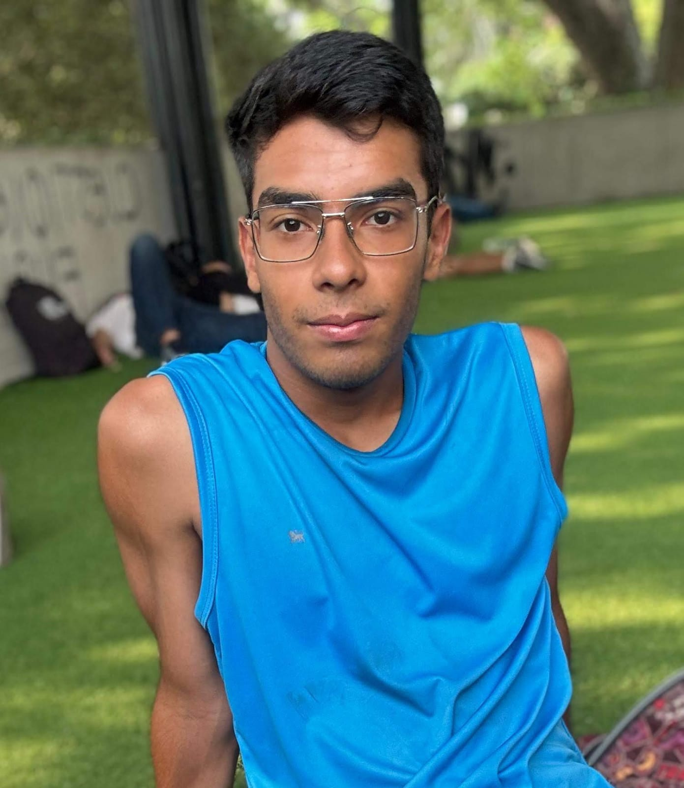

# BytesBuilders

## Juan Pablo Beleño Mesa

- **Edad:** 21 años
- **Profesión:** Estudiante de Ingeniería de Sistemas UIS
- **Intereses:** Tecnología, deportes y música
- **Descripción:** Yo soy Juan, un apasionado de la tecnología, siempre al tanto de las últimas innovaciones y tendencias en el campo del software. En mi tiempo libre, disfruto enormemente del fútbol. 
### Contacto
- **Correo:**  juanbmesa29@gmail.com 
- **GitHub:** https://github.com/JuanBeleno1

## Diego Alejandro Arévalo Quintero

- **Edad:** 19 años
- **Profesión:** Estudiante de Ingeniería de Sistemas UIS
- **Intereses:** Tecnología, Sistemas Operativos, Desarrollo Web, AI, música.
- **Descripción:** Me interesa la vanguardia tecnológica en cualquier aspecto, me apasiona cualquier cosa que agilize nuestros procesos y en general nos mejore y ayude. En mis tiempos libres me gusta hacer ejercicio, jugar video juegos y salir con amigos. 
### Contacto
- **Correo:** diegoarevalo2005@gmail.com
- **GitHub:** https://github.com/Diestroid
- **X:** https://x.com/unman_random

## Pablo José Cárdenas Meneses

- **Edad:** 25 años
- **Profesión:** Estudiante de Ingeniería de Sistemas UIS
- **Intereses:** Tecnología, videojuegos, música y deportes
- **Descripción:** Me interesa el desarrollo de videojuegos y la inteligencia artificial. En mi tiempo libre, practico taekwondo para mantenerme en forma y piano para relajarme y expresar mi creatividad. Estos pasatiempos equilibran mi vida y enriquecen mi bienestar personal.
### Contacto
- **Correo:** paburo99@gmail.com 
- **GitHub:** https://github.com/Paburo99

## Ana Valeria Barreto Tellez

- **Edad:** 19 años
- **Profesión:** Estudiante de Ingeniería de Sistemas UIS
- **Intereses:** Tecnologia, deportes , IoT
- **Descripción:** Me interesa el IoT, realizo constantemente cursos para fortalecer diversos conceptos en tecnologia (Platzi), me gusta hacer deporte y actualmente hago parte de la seleciion de futbol de la UIS.
### Contacto
- **Correo:** barretovaleria654@gmail.com 
- **GitHub:** https://github.com/ValeriaBarreto

## Brayan Julián Barrera Hernández

- **Edad:** 19 años
- **Profesión:** Estudiante de Ingeniería de Sistemas UIS
- **Intereses:** Videojuegos, volleyball, música, tecnología y los gatos.
- **Descripción:** Actualmente cursando sexto semestre. Me gustan los videojuegos, especialmente de un jugador, o jugar con amigos. Juego volleyball, soy armador. Me encuentro aprendiendo Desarrollo de Videojuegos con Unreal Engine.
### Contacto
- **Correo:** 1brayanbarrera@gmail.com
- **GitHub:** https://github.com/TheBrayanDev
- **LinkedIn:** https://www.linkedin.com/in/thebrayandev/
- **X:** https://twitter.com/thebrayandev

